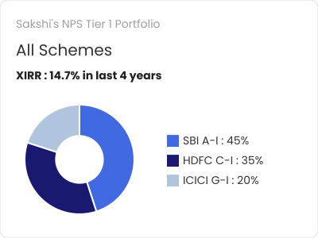

# NPS Portfolio Card Generator

This Go application generates visual portfolio summary cards for  NPS users. It takes user portfolio data in JSON format and produces a PNG image with a donut chart representing asset allocation, XIRR information, and other portfolio details.

## Features

- Generates a visually appealing PNG card from user portfolio data
- Displays allocation percentages as a donut chart with customizable colors
- Shows portfolio XIRR performance metrics
- Customizable image dimensions and font options
- Option to save intermediate SVG for debugging

### Sample Output


## Project Structure

```
nps-card-generator/
├── cmd/
│   └── nps-card-generator/
│       └── main.go         # Entry point with CLI handling
├── internal/
│   ├── models/
│   │   └── portfolio.go    # Data models for the portfolio
│   ├── generator/
│   │   └── card.go         # Card generation logic 
│   └── svg/
│       └── chart.go        # SVG generation functions
├── pkg/
│   └── utils/
│       └── font.go         # Font loading utilities
├── tests/
│   └── generator_test.go   # Test cases
├── assets/
│   ├── fonts/              # Font files directory
│   │   ├── Poppins-Regular.ttf
│   │   └── Poppins-Bold.ttf
├── go.mod
├── go.sum
└── README.md
└── portfolio.json # Dummy Data

```

## Requirements

- Go 1.16 or higher
- The following Go packages (will be installed automatically with `go mod tidy`):
  - github.com/golang/freetype
  - github.com/srwiley/oksvg
  - github.com/srwiley/rasterx

## Installation
https://github.com/Shashankpantiitbhilai/NPS_CARD_GENERATOR
1. Clone this repository:

```bash
git clone https://github.com/Shashankpantiitbhilai/NPS_CARD_GENERATOR

```

2. Download required dependencies:

```bash
go mod tidy
```

3. Download font files:

The application requires TTF font files. You can download Poppins fonts from Google Fonts:
- [Poppins Regular](https://fonts.google.com/specimen/Poppins)
- [Poppins Bold](https://fonts.google.com/specimen/Poppins)

Place these font files in the `assets/fonts/` directory or specify their paths using command-line flags.

## Usage

### Building the Application

```bash
# From the project root directory
go build -o bin/nps-card-generator ./cmd/nps-card-generator
```

### Basic Usage

```bash
# Using the built binary
./bin/nps-card-generator

# Or run directly with Go
go run ./cmd/nps-card-generator/main.go
```

This will read portfolio data from `portfolio.json` in the current directory and generate `nps_card.png`.

### Command-line Options

```bash
./bin/nps-card-generator -json path/to/portfolio.json -output output.png -regular-font assets/fonts/Poppins-Regular.ttf -bold-font assets/fonts/Poppins-Bold.ttf -width 500 -height 400 -save-svg
```

Available flags:
- `-json`: Path to the portfolio JSON file (default: `portfolio.json`)
- `-output`: Output PNG file path (default: `nps_card.png`)
- `-regular-font`: Path to regular font TTF file (default: `assets/fonts/Poppins-Regular.ttf`)
- `-bold-font`: Path to bold font TTF file (default: `assets/fonts/Poppins-Bold.ttf`)
- `-width`: Width of the output image (default: 400)
- `-height`: Height of the output image (default: 300)
- `-save-svg`: Save SVG version for debugging (default: false)

### JSON Format

The application expects a JSON file with the following structure:

```json
{
    "username": "Sakshi",
    "xirr": 14.7,
    "xirrPeriod": 4,
    "schemes": [
        {
            "name": "SBI A-I",
            "allocation": 45,
            "color": "#4169E1"
        },
        {
            "name": "HDFC C-I",
            "allocation": 35,
            "color": "#191970"
        },
        {
            "name": "ICICI G-I",
            "allocation": 20,
            "color": "#B0C4DE"
        }
    ]
}
```

Fields:
- `username`: User's name (displayed in the title)
- `xirr`: Expected Internal Rate of Return as a percentage
- `xirrPeriod`: Period in years for the XIRR calculation
- `schemes`: Array of investment schemes with:
  - `name`: Scheme name
  - `allocation`: Percentage allocation (should sum to 100)
  - `color`: Hex color code for the donut chart segment

## Running Tests

To run the unit tests:

```bash
go test ./tests
```

## Example Output

When run successfully, the application will generate a PNG image with:
- A circular donut chart showing scheme allocations
- A title with the user's name
- Subtitles indicating "All Schemes"
- XIRR percentage and period
- A legend showing scheme names and allocation percentages
### Output


